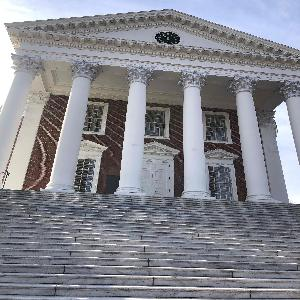
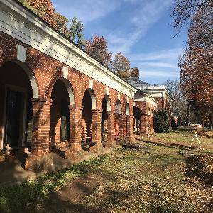
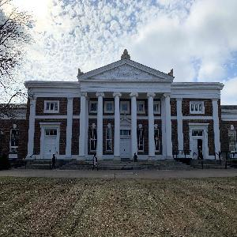

# UVA-landmarks-deep-learning-project

## 🧾 Summary

> Built and compared multiple CNN architectures (VGG16, AlexNet, ResNet18) using transfer learning to classify 18 landmark classes, achieving **95.8% accuracy** with ResNet by leveraging residual connections for efficient deep feature learning.

-brightgreen)

---

# 🏛️ UVA Landmark Image Classification

**Deep Learning Project | Computer Vision | PyTorch**

    

## 📌 Overview

This project develops a deep learning image classification system to recognize **18 historical landmarks at the University of Virginia**. Using transfer learning and multiple convolutional neural network (CNN) architectures, the goal was to compare model performance and identify the most effective approach for this task.

---

## 📊 Dataset

* ~14,000 images across 18 classes
* Examples include: Rotunda, Scott Stadium, Newcomb Hall, University Chapel
* Images resized to **224×224** and normalized using ImageNet standards

**Data Split:**

* Training: 70%
* Validation: 10%
* Test: 20%

---

## 🧠 Models Implemented

### 1. VGG-16

* Transfer learning with frozen convolutional layers
* Custom classifier head
* **Accuracy: 83%**
* Observed overfitting after ~5 epochs

---

### 2. AlexNet

* Pretrained model with modified classifier
* Dropout used for regularization
* **Accuracy: 89.3%**
* Balanced performance with stable training

---

### 3. ResNet-18 ⭐ (Best Model)

* Transfer learning with residual connections
* Fine-tuned final layer
* **Accuracy: 95.8%**
* Fast convergence (3 epochs) with strong generalization

---

## 📈 Results

| Model     | Test Accuracy | Key Characteristics                           |
| --------- | ------------- | --------------------------------------------- |
| VGG-16    | 83.0%         | Deep but overfits, high parameter count       |
| AlexNet   | 89.3%         | Simpler, stable, moderate performance         |
| ResNet-18 | **95.8%**     | Best performance, efficient, well-generalized |

---

## 🔍 Key Findings

* **ResNet-18 significantly outperformed other models**, demonstrating the effectiveness of residual connections for deep learning.
* **Transfer learning** greatly improved performance and reduced training time.
* Model depth alone does not guarantee better results—**architecture design is critical**.
* VGG-16 showed **overfitting and inefficiency**, while AlexNet provided a strong but limited baseline.

---

## ⚙️ Tech Stack

* **Python**
* **PyTorch**
* NumPy, Matplotlib
* torchvision (pretrained models)

---

